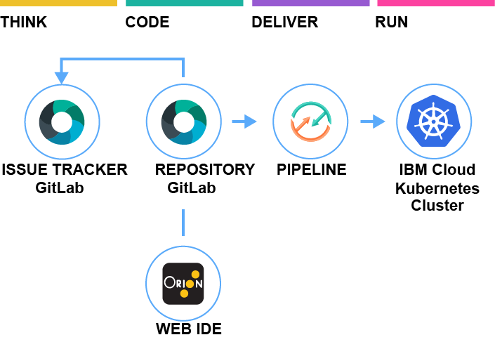

#  Develop a Kubernetes app

### Continuously deliver a signed and secured Docker app to a Kubernetes Cluster
This Hello World application uses Docker with Node.js and includes a DevOps toolchain that is preconfigured for continuous delivery with Docker image signature, Vulnerability Advisor, source control, issue tracking, and online editing, and deployment to the IBM Cloud Container service.

Application code is stored in source control, along with its Dockerfile and its Kubernetes deployment script.
The target cluster is configured during toolchain setup (using a IBMCloud API key and cluster name). You can later change these by altering the Delivery Pipeline configuration.
Any code change to the Git repo will automatically be built, validated and deployed into the Kubernetes cluster.

The DCT initialization pipeline is in charge of the Docker Content Trust initialization of the IBM Container Registry repository and image. This pipeline will run initially (auto-execution) just after the toolchain creation.

The Delivery pipeline that build, check and deploy the Docker app to the Kubernetes cluster is not auto-executed after the toolchain creation as it can only be successful after the DCT initialization pipeline first execution.

Keys used for signing Docker images are stored securely in a Key protect service instance which name needs to be provided in the template (`Key Protect Vault Instance name`)

### To get started, click this button:

#### Known limitations (to be fixed in future versions):
- Key Protect service instance can not have space/blank in its name
- Key ID/alias name in Key Protect should not have name longer than 50 char - https://cloud.ibm.com/apidocs/key-protect#create-a-new-key
- Initialization of DCT for a namespace perform both the root key and repository initialization, this needs to
  be revisited to simplify multiple images signing in the same namespace (and also to possibly reuse pem/pub keys inside namespace for different images signing)

---
### Learn more 

* Blog [Continuously deliver your app to Kubernetes with Bluemix](https://www.ibm.com/blogs/bluemix/2017/07/continuously-deliver-your-app-to-kubernetes-with-bluemix/)
* Step by step [tutorial](https://www.ibm.com/devops/method/tutorials/tc_secure_kube)
* [Getting started with Bluemix clusters](https://cloud.ibm.com/docs/containers?topic=containers-getting-started)
* [Getting started with toolchains](https://cloud.ibm.com/devops/getting-started)
* [Documentation](https://cloud.ibm.com/docs/services/ContinuousDelivery?topic=ContinuousDelivery-getting-started&pos=2)
* [Signing images for trusted content](https://cloud.ibm.com/docs/services/Registry?topic=registry-registry_trustedcontent)
* [Content trust in Docker](https://docs.docker.com/engine/security/trust/content_trust)
* [Enforcing container image security](https://cloud.ibm.com/docs/services/Registry?topic=registry-security_enforce)
* [Getting started with Key Protect](https://cloud.ibm.com/docs/services/key-protect?topic=key-protect-getting-started-tutorial)